# 🤖 Jarvis-PersonalizedSaasBot  
*Self-Hosted RAG Assistant Powered by Llama + Pinecone + Next.js*

Jarvis-PersonalizedSaasBot is a **private AI documentation assistant** that instantly answers questions about a SaaS product's features, pricing, security, and how-to guidance — grounded in real internal documentation with source citations.

This is a **fully self-hosted enterprise AI copilot**, ensuring **data stays private** with no external cloud usage.

---

## ✨ Key Features

- 🔐 **Self-Hosted LLM** using LM Studio (Llama-3.2-3B-Instruct)
- 🧠 **RAG Retrieval** using Pinecone for accurate context matching
- 📚 **Answers with citations** → audit-ready & trusted
- 🎨 **Cinematic UI** built in Next.js + Framer Motion
- 💬 **Real-time chat** with typing animation + online status indicator
- 🔄 **Start new session** any time
- 📄 **Download chat** as `.txt` transcript
- 🚦 **Backend & model health monitoring**
- 🧩 **Modular architecture** → easy to extend

---

## 🏗 Architecture

```mermaid
flowchart TD
    A([✨ Next.js Frontend]) --> B([🧠 Node.js RAG Backend])
    B --> C([🔍 Pinecone Vector Database])
    B --> D([🤖 Llama Model via LM Studio])
```



---

## 📂 Project Structure

```
Jarvis-PersonalizedSaasBot/
├── frontend/         # Next.js UI
│   ├── app/
│   ├── components/
│   ├── hooks/
│   └── public/
└── backend/          # Chat + RAG Engine (Node.js)
    ├── server.js
    ├── .env
    └── package.json
```

---

## 🚀 Setup Instructions

### 1️⃣ Backend Setup

```bash
cd backend
npm install
```

Create a `.env` file in the `backend/` directory:

```env
LMSTUDIO_BASE_URL=http://localhost:1234/v1
PINECONE_API_KEY=your_key_here
PINECONE_INDEX=jarvis-knowledge
PINECONE_REGION=us-east-1
PORT=8000
```

Start the backend server:

```bash
node server.js
```

### 2️⃣ Frontend Setup

```bash
cd ../frontend
npm install
npm run dev
```

The app will be available at `http://localhost:3000`

---

## 💡 How It Works

1. **User asks a question** via the chat interface
2. **Backend retrieves relevant context** from Pinecone vector database
3. **Sends query + context** to Llama running in LM Studio
4. **Gets grounded response** with proper citations
5. **UI displays answer** + sources + token stats
6. **Transcript downloadable** for compliance & review

---

## 🧪 Try These Demo Prompts

- What does this SaaS product do?
- How do users track tasks?
- Compare Business vs Enterprise plan
- Tell me more about SOC2 compliance
- What security certifications do you have?
- How do I integrate with my existing tools?
- Download transcript

---

## 🛡 Security Highlights

- 🚫 **No cloud inference** → zero data leakage
- 🔒 **Fully self-hosted deployments**
- 📍 **Works even in offline environments** (except Pinecone)
- 🏢 **Enterprise-compliant setup**
- 🔐 **Private data never leaves your infrastructure**

---

## 📸 Demo Video & Screenshots

### 🎥 Video Demonstration

See Jarvis in action:

👉 [**Watch Demo Video**](https://drive.google.com/file/d/1s3eSjGxs9JiNGOJbZBpLQ0cO5jXXGeKB/view?usp=sharing)

### 📸 UI Preview

#### 🔹 Landing Page (Jarvis Reactor Animation)


#### 🔹 Chat Screen (Citations + RAG Retrieval)


## 🛠 Tech Stack

| Component | Technology |
|-----------|-----------|
| **Frontend** | Next.js 14, React, Tailwind CSS, Framer Motion |
| **Backend** | Node.js, Express |
| **LLM** | Llama 3.2 (3B Instruct) via LM Studio |
| **Vector DB** | Pinecone |
| **Deployment** | Self-hosted (Docker-ready) |

---

## 📄 License

This project is licensed under the MIT License - see the [LICENSE](LICENSE) file for details.

---
